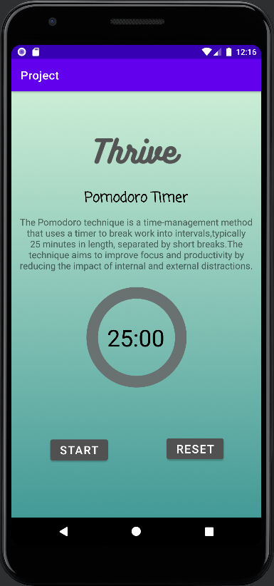

# Thrive_Productivity_App
A real time productivity app with pomodoro timer, habit tracker, mood tracker, event calendar and other features with real time user authentication and data storage using Firebase.
Problem Statement (Application of the project)
The  problem  that  Thrive aims  to  solve  is  the  growing  challenge  that  individuals  face  in managing their time, productivity, and overall well-being. Many people struggle to balance work,  personal  life,  and  other  commitments,  leading  to  stress,  burnout,  and  a  lack  of productivity. Additionally, individuals often find it difficult to establish and maintain good habits  and  routines,  which  further  contributes  to  their  productivity  and  well-being challenges.
|  |  |  |  |
| ---------------------------------------------- | -------------------------------------------- | ------------------------------------------- | ------------------------------------------- |

